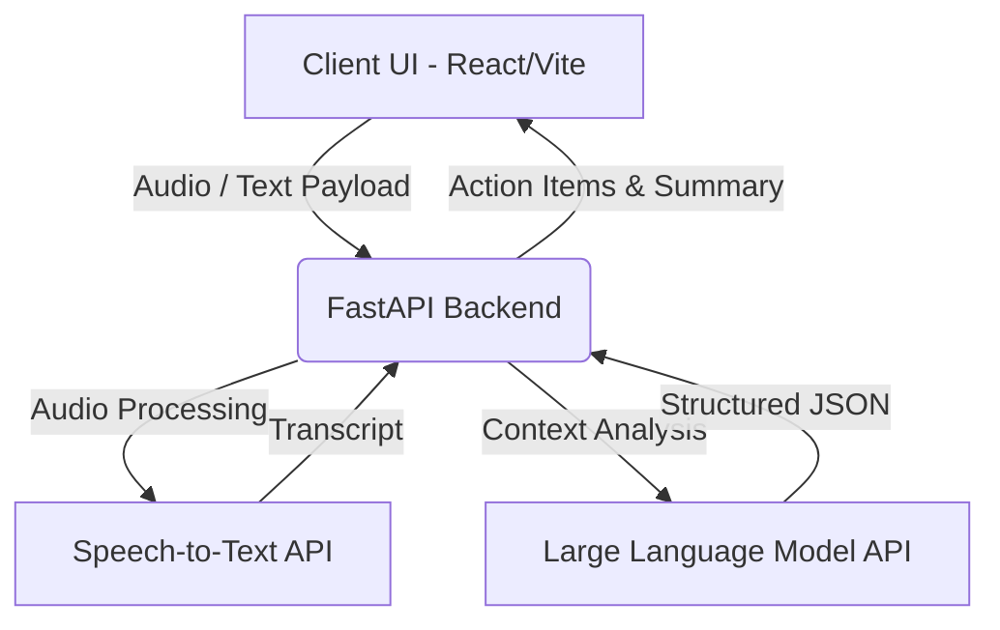

# Voice Notes → Action Items

[](https://voice-notes-rouge-six.vercel.app/)
[]()
[]()
[](https://www.python.org/downloads/)
[](https://reactjs.org/)

> 🌐 **Live Website:** [https://voice-notes-rouge-six.vercel.app/](https://voice-notes-rouge-six.vercel.app/)

An AI-powered application designed to streamline productivity by converting unstructured voice notes into structured, actionable tasks. Utilizing state-of-the-art Speech-to-Text and Large Language Models (Google Gemini & OpenAI Whisper/GPT), this application automatically extracts action items, identifies deadlines, assigns priorities, and generates concise summaries from natural speech.

---

## 📖 Table of Contents

- [Overview](#overview)
- [Key Features](#key-features)
- [Architecture](#architecture)
- [Technology Stack](#technology-stack)
- [Getting Started](#getting-started)
  - [Prerequisites](#prerequisites)
  - [Installation](#installation)
- [Usage](#usage)
- [API Documentation](#api-documentation)
- [Project Scope and Roadmap](#project-scope-and-roadmap)
- [Contributing](#contributing)
- [License](#license)

---

## 🎯 Overview

Professionals often record voice notes to capture fleeting thoughts or complex multi-step instructions. However, manually processing these audio files into to-do lists can be tedious. **Voice Notes → Action Items** bridges this gap. 

For example, given the input:
> *"I need to finish the project tomorrow, submit the report on Monday, and call Rahul about the presentation."*

The AI processing pipeline yields:
- **Action Item 1**: Finish the project | **Deadline**: Tomorrow | **Priority**: High
- **Action Item 2**: Submit the report | **Deadline**: Monday | **Priority**: High
- **Action Item 3**: Call Rahul | **Deadline**: None | **Priority**: Medium

---

## ✨ Key Features

- **In-Browser Audio Recording**: Seamlessly record and preview voice notes natively in the browser using the MediaRecorder API.
- **Speech-to-Text Processing**: Robust transcription of audio files leveraging advanced AI endpoints.
- **Intelligent Extraction**: NLP-driven parsing of transcripts to accurately identify discrete tasks, implied or explicit deadlines, and task priority.
- **Smart Task Management**: An intuitive interface to review, complete, and delete extracted tasks.
- **Multi-Modal Input**: Support for direct text input to bypass audio recording when necessary.
- **Responsive Design**: Optimized for cross-device compatibility (Desktop, Tablet, Mobile).

---

## 🏗️ Architecture

The application adopts a decoupled client-server architecture to ensure scalability and ease of deployment.



---

## 🛠️ Technology Stack

**Frontend**
- **Framework**: React (Bootstrapped with Vite)
- **Language**: JavaScript (ES6+)
- **Styling**: Modern CSS3
- **Audio Capture**: Browser Native MediaRecorder API

**Backend**
- **Framework**: FastAPI (Python)
- **AI Integrations**:
  - Speech-to-Text Provider
  - LLM Provider (e.g., OpenAI)

**Infrastructure & Deployment**
- **Frontend Hosting**: Vercel
- **Backend Hosting**: Railway

---

## 🚀 Getting Started

### Prerequisites

- [Node.js](https://nodejs.org/en/) (v16.x or higher)
- [Python](https://www.python.org/) (v3.9 or higher)
- An active API key for the LLM / Speech-to-Text provider (e.g., OpenAI)

### Installation

**1. Clone the Repository**
```bash
git clone https://github.com/DurgaPrasadU616/Voice-Notes.git
cd Voice-Notes
```

**2. Backend Setup**
```bash
# Navigate to the backend directory
cd backend

# Create and activate a virtual environment
python -m venv .venv
# On Windows: .venv\Scripts\activate
# On macOS/Linux: source .venv/bin/activate

# Install dependencies
pip install -r requirements.txt
```

Create a `.env` file in the `backend` directory and add your credentials:
```env
OPENAI_API_KEY=your_api_key_here
```

**3. Frontend Setup**
```bash
# Open a new terminal and navigate to the frontend directory
cd frontend

# Install Node modules
npm install
```

---

## 💻 Usage

**Running the Backend Server**
```bash
cd backend
# Ensure virtual environment is active
uvicorn app.main:app --reload
```
The backend API will be available at `http://127.0.0.1:8000`.

**Running the Frontend Client**
```bash
cd frontend
npm run dev
```
Navigate to `http://localhost:5173` in your web browser. 

Click the **Record** button to capture a voice note, or switch to **Text Input** to manually type your tasks. The system will process the input and generate a smart task list.

---

## 🔌 API Documentation

### 1. Transcribe Audio
**Endpoint:** `POST /api/transcribe`
Converts uploaded audio payloads into text transcripts.

- **Content-Type**: `multipart/form-data`
- **Payload**: `audio` (File)

**Response:**
```json
{
  "transcript": "Finish the project by tomorrow."
}
```

### 2. Extract Action Items
**Endpoint:** `POST /api/extract-actions`
Parses text to extract structured actionable metadata.

- **Content-Type**: `application/json`
- **Payload**:
```json
{
  "text": "Finish the project by Friday and call Rahul tomorrow."
}
```

**Response:**
```json
{
  "summary": "Two project-related tasks were identified.",
  "action_items": [
    {
      "task": "Finish the project",
      "deadline": "Friday",
      "priority": "High"
    },
    {
      "task": "Call Rahul",
      "deadline": "Tomorrow",
      "priority": "Medium"
    }
  ]
}
```

---

## 🗺️ Project Scope and Roadmap

**Current MVP Scope:**
- Core recording and transcription pipeline.
- AI-driven task, priority, and deadline extraction.
- Essential task management (Create, Read, Update/Complete, Delete).

**Future Enhancements:**
- User Authentication and persistent task storage (Database integration).
- Calendar and Google Tasks synchronization.
- Multi-language transcription support.
- Automated email or push notification reminders.
- Export functionality (PDF/CSV).

---

## 🛡️ Security Best Practices

- **Environment Variables**: All secret keys and configuration variables are isolated in `.env` files and strictly excluded from version control (`.gitignore`).
- **Client-Side Safety**: No API keys or sensitive credentials are ever exposed in the frontend bundle.
- **Input Validation**: Backend routes stringently validate audio file types and JSON payloads.

---

## 🤝 Contributing

Contributions are welcome. If you find a bug or have a feature request, please open an issue. For code contributions:

1. Fork the repository.
2. Create a feature branch (`git checkout -b feature/AmazingFeature`).
3. Commit your changes (`git commit -m 'Add some AmazingFeature'`).
4. Push to the branch (`git push origin feature/AmazingFeature`).
5. Open a Pull Request.

---

## 📄 License

This project is licensed under the [MIT License](LICENSE).
